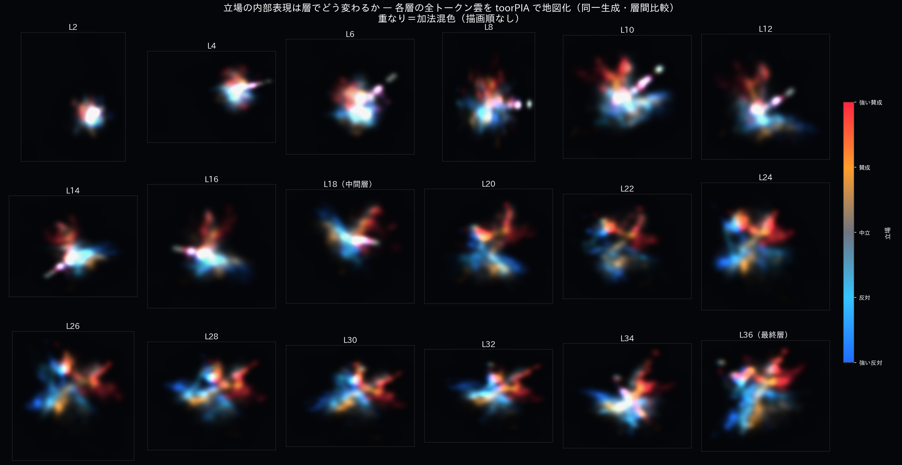
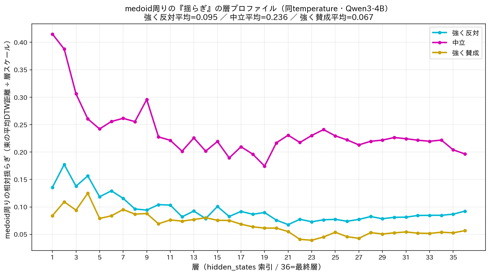

# 立場は“層を深めながら”像を結び、芯のまわりで揺らぐ ― 派生研究：層ごとの内部表現とゆらぎ

[`STANCE_CONTINUITY.md`](STANCE_CONTINUITY.md)（立場の連続性）からさらに踏み込み、
**LLM の内部表現が「浅い層→深い層」へと進むにつれて立場をどう形づくっていくか**、そして
**同じ問いを何度も答えさせたときに内部がどれだけ“揺らぐ”か**を可視化・定量した派生研究です。

---

## これは何か（ひとことで）

同じ問い **「原発は正しいエネルギー政策か？」** を、Qwen3-4B に
**「強く反対」「強く賛成」（＋「中立」）** の立場で **各 30〜40 回** 答えさせ、
各回答の **全トークンの内部状態（隠れ状態・2,560次元）** を、ニューラルネットの
**浅い層 → 深い層** へ順に **toorPIA** で2次元地図にしました。

---

## 見どころ① ― 層を深めるほど、立場が「分化」していく


> 高画質: [日本語 MP4](images/anim_stance_morph_strip_medoid.mp4) ／ [英語 MP4](images/anim_stance_morph_strip_en.mp4)・[英語 GIF](images/anim_stance_morph_strip_en.gif)（HP用）

- **浅い層**では、青（反対）と赤（賛成）は混ざり合った **ぼやけた一つの塊**。AI はまだ語を
  “単語そのもの”としてしか持っておらず、立場は **未分化**。
- **層が深くなるにつれ**、青と赤が **くっきり分かれて** いき、点の群れが
  **複雑な鎖状（フィラメント）構造** へ織り上がっていきます。1本の鎖は、文脈を取り込んだ語が
  連なって1つの回答（文）を成していく道筋です。
- 画面下の **リボン**は全36層を横一列に並べたもので、黄色い枠が「いま見ている層」を左→右に示します。
- 太い **発光する線** ＝ 各立場の **「代表的な回答（medoid）」**（後述）。

全36層を一枚で俯瞰すると、浅層の混在から深層の分離・構造化への流れが見えます：



---

## 見どころ② ― 芯のまわりの“揺らぎ”を測る：**中立が最も揺れる**

同じ問いを **同じ温度で** 何度も答えさせると、内部の軌跡は毎回少しずつ違います
＝ **モデルが内部で生み出す「揺らぎ」**。各立場の **代表（芯＝medoid）のまわりの広がり** を測ると：



- **中立は、すべての層で最も大きく揺らぐ**（強く反対・強く賛成の **2.5〜3.5倍**）。
- 温度を全条件でそろえてあるので、この差は **温度ではなくモデルの内部状態そのものに由来**します。
- つまり **「確信した立場ほど内部は締まり、中立ほど内部が揺れる」**。
  これは正答率やテキストでは見えない、**“決断性・確信度”の指標**です。

3立場（反対=cyan／中立=magenta／賛成=yellow）を同時に地図化し、各立場の芯と代表回答文を重ねた版：


> 高画質: [MP4](images/anim_morph3_medoid.mp4)

---

## なぜ重要か ― LLM 品質評価へ

ベンチマークの正答率は **出力テキスト** の評価で、モデルが内部で答えをどう扱っているか
（迷わず確信しているか／立場を連続的に表せるか／毎回ブレないか）は見えません。
本研究は、内部状態の可視化を **テキストでは測れない“振る舞いの質”の定量化** に育てる試みです：

- **立場の連続性**（賛成↔反対の滑らかさ＝キャリブレーション）… [`STANCE_CONTINUITY.md`](STANCE_CONTINUITY.md)
- **表現の発生・分化が起きる層**（浅→深のどこで立場が像を結ぶか）
- **内部の揺らぎ＝確信度／決断性**（芯のまわりの広がり。**中立ほど大きい**）

---

## 方法（簡潔に）

| 段階 | 内容 |
|---|---|
| 抽出 | 全36層の **全トークン hidden state** を1回の生成パスで取得（[`16_extract_all_layers.py`](experiments/scripts/16_extract_all_layers.py)） |
| 地図化 | 各層を **toorPIA** で2次元へ（[`16b_fit_layers_toorpia.py`](experiments/scripts/16b_fit_layers_toorpia.py)） |
| 層間整合 | 最終層を固定し、深→浅へ **回転＋鏡像反転のみ**（スケールは変えない）で対応づけ。原点からの距離＝**隠れ状態の広がり**（log スケール）で表示 |
| 代表（芯） | 各立場の **medoid**＝他のすべての回答軌跡への距離の総和が最小の **実在する代表回答**。距離は **DTW**（長さの違う鎖を対応づける）。**最終層・高次元(2,560D)で決めた1本を全層で使用** |
| 揺らぎ | 芯から他の回答への平均 DTW 距離（その層のスケールで正規化）＝束の広がり |

> **medoid を選ぶときの注意**：DTW はトークン長で値が変わるため、回答長が極端にばらつくと
> 代表が不定になりがちです。**簡潔に答えさせて長さをそろえる**、または **長さの中央値付近から選ぶ**
> （`--length-band 0.25` で候補を長さ中央値±25%に絞る＝長さバランス medoid）。
> 長さ依存がさらに気になる場合は **弧長で再サンプル＋Fréchet** や **Wasserstein（順序を問わない）** に
> 置き換える、といった配慮をします。

描画と汎用パイプライン（最大3立場・cyan/magenta/yellow・代表回答文の表示）は
[`anim_morph_medoid_general.py`](experiments/scripts/figures/anim_morph_medoid_general.py)、
揺らぎの定量は [`fig_bundle_spread.py`](experiments/scripts/figures/fig_bundle_spread.py)。

---

## 再現（GPU ＋ toorPIA）

```bash
cd experiments
# 1) 全層・全トークンの hidden state を抽出（最大3立場のプロンプトyaml・各N回・出力文も保存）
LAYERS=$(seq -s, 1 36)
python scripts/16_extract_all_layers.py --model Qwen/Qwen3-4B --load-4bit --no-think \
  --sample --n-sample 30 --gen-batch 15 --temperature 1.0 --max-new-tokens 90 \
  --prompts your_prompts.yaml --layers "$LAYERS" --outdir-name myrun --save-texts

# 2) 各層を toorPIA で地図化（要 env.sh / 大規模は localhost）
python scripts/16b_fit_layers_toorpia.py --model Qwen/Qwen3-4B --outdir-name myrun

# 3) 層モーフ＋各立場の芯(medoid)＋代表回答文のアニメ
python scripts/figures/anim_morph_medoid_general.py --model Qwen/Qwen3-4B --outdir-name myrun \
  --title "層が深くなるにつれ立場が分化していく" --labels "強く反対,中立,強く賛成"

# 4) 芯まわりの“揺らぎ”の層プロファイル
python scripts/figures/fig_bundle_spread.py --model Qwen/Qwen3-4B --outdir-name myrun \
  --labels "強く反対,中立,強く賛成"
```

---

## 応用の展望：芯まわりの揺らぎを「未収束性の内部信号」として使う

芯のまわりの広がり（揺らぎ）を、ただちに「確信度」と断定する必要はない。それは、モデルが判断を絞り込めていない状態だけでなく、入力プロンプトが曖昧で複数の解釈を誘発している状態、あるいは問いそのものが多義的である状態を反映している可能性がある。

重要なのは、揺らぎが大きいとき、それを「そのまま回答してよい状態ではない」という**制御信号**として使える点である。たとえば、追加の推論ステップを走らせる／反対視点から再検討させる／入力者に前提や評価軸の明確化を求める、といったフィードバックに接続できる。したがって芯まわりの揺らぎは、単なる確信度指標ではなく、**LLM とプロンプトの相互作用における未収束性・曖昧性・追加思考必要度**を示す内部信号として捉えるのが適切である。

この位置づけは、既存の test-time 手法との対比で意義が見える。回答が多数決で評価できる場合（算数・選択式など）は self-consistency（多数決）が効率的で実績もあり、内部信号がそれを上回るのは難しい。コードも、**テストで検証できる機能面は実行ベースの多数決・検証が強い**。一方、**出力が自然文である場合や、テスト/仕様の無いコード・設計判断・非機能要件のように外形だけでは正否を投票・検証しにくい場合**――実利用ではむしろこちらが大半だが――多数決や実行検証が効かない。ここで、**出力の不一致ではなく内部の未収束性そのもの**を信号化できることに固有の価値がある。

なお、これは現時点では**仮説**である。実効性は、(1) 揺らぎが正誤・品質と相関するか（誤り検出の AUROC など）、(2) 揺らぎが大きい入力にだけ計算を厚くする「適応計算」が一律の多数決より**精度-計算のパレートを改善**するか、で定量検証する必要がある。また揺らぎはサンプリング温度に媒介される量である（温度 0 では生じない）点にも留意する。

---

ライセンス: MIT / Copyright (c) 2026 toor Inc.（図は toorPIA 出力を含む）
