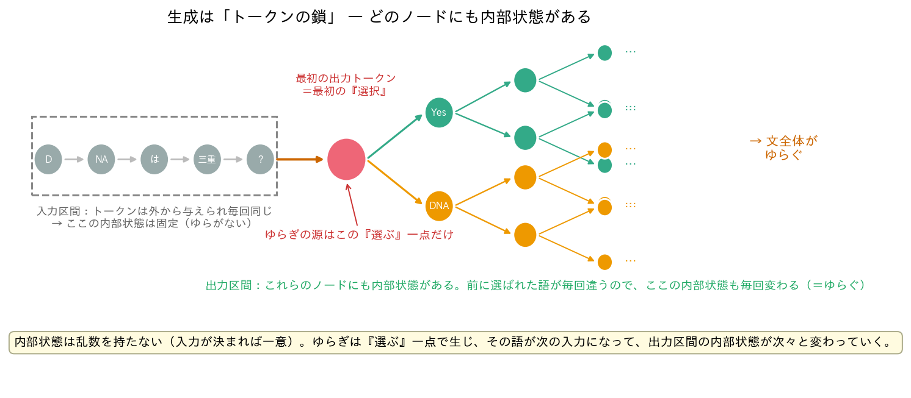
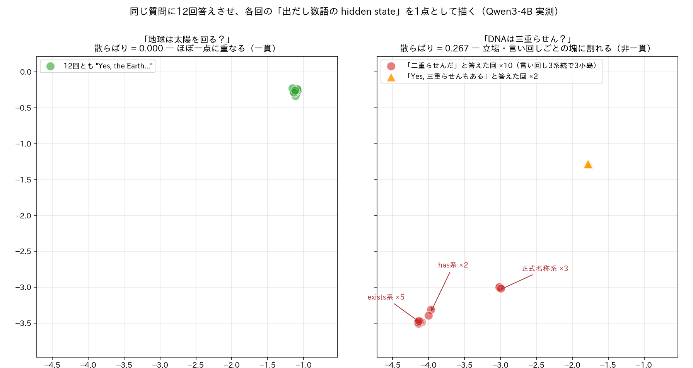
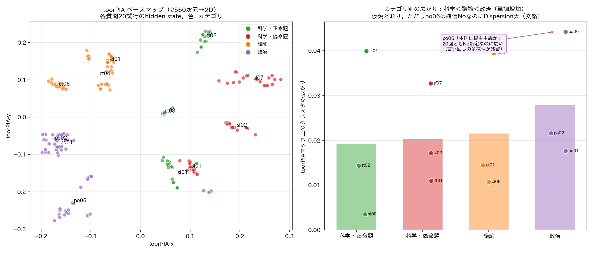
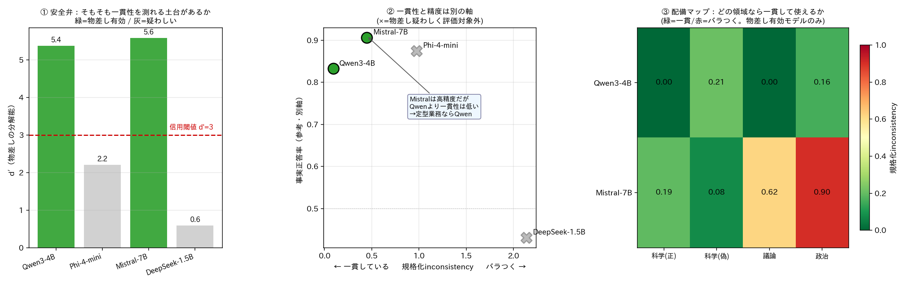
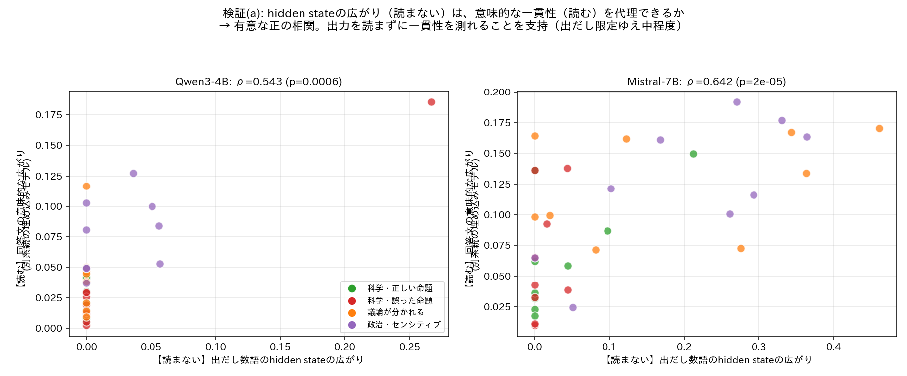

# 🧠 LLMの「頭の中」を覗く ― hidden stateとは何を表しているのか

**高次元データ実用分析 第8回 / 大規模言語モデル(LLM)の可視化とAIエージェント連携**

> この資料は、予備知識ゼロから「LLMの内部状態（hidden state）が何を表しているのか」を順に理解し、最後に**実務でLocal LLMを使うための新しい品質評価**へつなげることを目標にします。
>
> （旧版 `SLIDES.md` は、対立命題テスト・HBDI指標の参照資料として残してあります。本資料はその発展・再構成版です。）

---

# スライド 1: 今日の問い

## 🤔 たった一つの問い

LLMに質問すると、**文章**が返ってきます。
でもその文章は、モデルの中で起きていることの「**結果**」にすぎません。

> **その「中で起きていること」＝ hidden state とは、いったい何を表しているのか？**

## 🎯 今日のゴール

1. hidden state が何かを、ゼロから理解する
2. それが「**意味**」と「**次に何を言うか**」と「**どれくらい確信しているか**」を持つことを、実験で確かめる
3. それを使って、**出力文を読まずにLLMの一貫性を測る**という、実務に効く応用に到達する

## 🧭 進め方

各ステップは「素朴な疑問」→「実際に手元のLLMで確かめた結果」の順で進みます。今日の図はすべて、講師が実際に複数のLocal LLM（Qwen, Mistral, Phi, DeepSeek）を動かして測ったものです。

---

# スライド 2: そもそも LLM はどう文章を作るのか

## ✍️ 一語ずつ作っている

LLMは文章を一気に作りません。**単語（トークン）を一つずつ**選んでいきます。

```
質問:「地球は太陽の周りを回っていますか？」
   ↓
「はい」を選ぶ → 「、」を選ぶ → 「地球」を選ぶ → 「は」を選ぶ → …
```

## 🔢 各ステップで「内部状態」を持っている

一語選ぶたびに、モデルの内部には **数千個の数字の並び（ベクトル）** があります。これが **hidden state** です。

```
ある瞬間の hidden state = [0.8, -0.2, 0.6, 0.1, ... ]   ← 例: 2560個の数字
```

- この数字の並びから、次の一語が決まります
- まずはこれを「**モデルがいま持っている、頭の中の状態を数値化したもの**」と捉えてください

---

# スライド 3: 実務の壁 ― 同じ質問でも、Local LLM の答えは「ゆらぐ」

## 🏭 自分のPCやサーバーでLLMを動かして、業務に使いたい

クラウドに送れない社内データを扱うため、手元の**Local LLM**を業務フローに組み込みたい――そういう場面が増えています。ところが、すぐに壁にぶつかります。

## 😵 同じ質問を何度かしてみると…

実際に手元のLLMで、同じ質問を12回ずつ繰り返してみました。

- 「地球は太陽を回る？」→ 12回すべて **"Yes, the Earth revolves around the Sun…"**（毎回ほぼ同じ＝**安定**）
- 「DNAは三重らせん？」→ ある時は **"Yes, triple helix"**、ある時は **"double helix"**（毎回違う＝**ゆらぐ**。しかも事実問題で答えが矛盾する）

## 🚨 これが実務で致命的な理由

- **一回聞いただけでは、その答えが「いつも返る安定した答え」なのか「たまたま出た一つ」なのか分からない**
- 業務に載せるなら、たとえ間違っていても「**いつも同じ**」なら運用を設計できる。「**毎回違う**」と設計できない
- だから「このモデルは、この種の入力に対してどれくらい**ゆらぐ**のか」を知ることが、配備の死活問題になる

> **今日のゴールは、この「ゆらぎ」の正体を内部（hidden state）から解き明かし、最後には〈出力文を読まずにゆらぎの大きさを測る〉ところまで行くことです。**

---

# スライド 4: 【事実1】では、その「ゆらぎ」はどこから来るのか

## ⛓️ 生成は「トークンの鎖」 ― 一語ごとにノードがつながっていく

LLMの生成は、一語ごとにノードを継ぎ足していく**鎖**としてイメージできます。



内部状態（hidden state）は、**鎖のどのノードにもあります**（入力区間にも、出力を作っている各ノードにも）。区間ごとに見ていきます。

- **入力プロンプトの区間**：トークンは**外から与えられる**ので、鎖は毎回まったく同じ。だからここの内部状態は固定で、**ゆらぎようがない**（当たり前の話）
- **最初の出力トークン**：ここで初めて、モデルが**自分で一語を選ぶ**。同じ確率（オッズ）からの「引き」なので、出目が毎回違いうる ― **ゆらぎの源はこの『選ぶ』一点だけ**
- **その後（出力区間）**：選ばれた語が**次のノードの入力**になる。前に選んだ語が毎回違うので、**出力区間のノードの内部状態も毎回変わる**。鎖は枝分かれし、**ゆらぎが積み重なって文全体がゆらぐ**

## 💡 ここでの要点

> 内部状態そのものは**乱数を持ちません**（それまでのトークンが決まれば一意に決まる、決定的な計算）。ゆらぎの源は**『選ぶ』一点だけ**。その出目が次の入力になって、出力区間の内部状態が次々と変わっていきます。

だから「ゆらぎを測る」には、〈最初の選択の状態が何を表しているか〉を理解し、次に〈そこから先でどれだけ違う鎖に分かれるか〉を見ればよい ― これが以降の道筋です。

---

# スライド 5: 【事実2】hidden state は「文脈の中の意味」を表す

## 🤔 素朴な疑問

「同じ単語なら、hidden state も同じ？」

## 🧪 確かめたこと

いろいろな質問に「**No**」で答えさせ、その「No」の位置の hidden state を比べました。

- 「太陽は地球を回る？」→ **No**
- 「水は100℃で凍る？」→ **No**
- 「マルセイユは首都？」→ **No**

## ✅ 結果

| | 同じ質問の中の「No」どうし | 別の質問の「No」どうし |
|---|---|---|
| 違い | **ゼロ**（完全に同じ） | **はっきり違う**（0.09〜0.13） |

> 同じ「No」でも、**前にどんな文脈があったかで状態が変わる**。

## 💡 ここで大事なこと

hidden state が表しているのは、表面の**文字**ではなく「**その文脈での意味**」です。だから、似た意味の状態は近くに、違う意味の状態は遠くに置かれます。これが後で効いてきます。

---

# スライド 6: 【事実3】hidden state は「次に何を言うか」をすでに持っている

## 🧪 確かめたこと

質問を読み終えた**末尾の状態**から、「**最初の一語が何になりそうか**」の確率を読み取れます（スライド4の②そのものです）。まだ一文字も書かせていない時点で、です。

## ✅ 結果

- 「地球は太陽を回る？」→ P(はい) がほぼ100% ― 最初の語は「はい」に決まっている
- 「台湾は独立国？」→ P(はい) も P(いいえ) もほぼ0%で、「**これは**（複雑な問題で）…」に倒れている

この読み取りは、**実際に答えさせたときの出だしとよく一致**しました。「答えさせる前に、答えの出だしが分かる」わけです。

## ⚠️ ただし、これで「態度」まで分かった気になってはいけない

ここで読めたのは、あくまで「**最初の一語**」です。「**確信しているか、迷っているか**」という態度まで読めたわけではありません。次の2つの質問を比べると、その差が見えます。

| 質問 | 実際の答え | 態度 | 最初の一語 |
|---|---|---|---|
| 「台湾は独立国？」 | 「**これは**複雑な問題で、見方によって…」 | **迷い**（留保） | 「これは」― はい/いいえ ではない |
| 「中国は民主主義国？」 | 「**中国は**民主主義ではありません。一党制で…」 | **確信**（明確な否定） | 「中国は」― はい/いいえ ではない |

片方は迷い、片方は確信を持った断定。態度は正反対なのに、**最初の一語だけ見るとどちらも「はい/いいえで始まらない」で区別がつきません**。「いいえ」と言い切る代わりに、主語から入って言い切る答え方があるからです。

> **最初の一語が教えてくれるのは「答えの出だしの形」。「確信か迷いか」は、一回の読み取りでは分からない。**

ではどうするか？ ― 次のステップが今日の核心です。

---

# スライド 7: 【核心】何度も答えさせて、状態の「散らばり」を見る

## 💡 発想の転換 ― スライド3の「ゆらぎ」を、内部状態で測る

一回の読み取り（一点）では態度が分かりませんでした。なら、**同じ質問に何度も答えさせて、内部状態を点の集まり（点群）として見ればよい**。

**測り方（1回の試行 ＝ 1つの点）**：

1. 質問に答えさせ、**出だし数語ぶんの hidden state を平均して、1本のベクトル**にする
   - 出だし数語を使う理由：答えの方向性は出だしに最も素直に現れる一方、回答の後半まで含めると、同じ立場でも**言い回しの違い**で点がぶれてしまうため
2. これを何度も繰り返して（今日の実験では12〜20回）、点群を得る
3. **点群の散らばり**（点どうしの平均距離）を計算する

```
一貫した質問 → 毎回ほぼ同じ出だし → 点群が一点に重なる
割れる質問   → 出だしが毎回違う   → 点群が複数の塊に分かれる
```

## 📋 測定に使った質問セット

性格の違う質問を4種類 × 9問 ＝ **36問** 用意しました（測定は英語の質問で実施。以降のスライドにも、この4種類が登場します）：

| 種類 | 例 |
|---|---|
| 科学・正しい命題 | 「地球は太陽を回る？」 |
| 科学・誤った命題 | 「太陽は地球を回る？」 |
| 議論が分かれる | 「原発は気候変動対策の最良手段？」 |
| 政治・センシティブ | 「台湾は独立国？」 |

## ✅ 結果 ― 両極端の2問を見る



- 「地球は太陽を回る？」：12回とも同じ出だし → **点が一点に重なり、散らばり 0.000**
- 「DNAは三重らせん？」：「二重らせんだ」×10回と「Yes、三重らせんもある」×2回に**実際に立場が割れ**、点群も**立場ごとの塊**に分かれる → 散らばり 0.267

> **点群の散らばり ＝ その質問への答えがどれだけ一貫しているか。**
> 出力文を読まなくても、点群を見れば分かる ― これが今日の核心の道具です。

---

# スライド 8: 散らばりを「見える化」する ― toorPIA

## 🗺️ 全部の質問を、一枚のマップで見渡す

hidden state は数千次元の点なので、そのままでは見えません。本講義で学んできた**高次元データの可視化（toorPIA）**に投入すると、全質問の点群を一枚で見渡せます。代表12問 × 各20回 ＝ 240点：



## ✅ マップの読み方

- **一点に固まっている質問**：20回ぶんの状態がぴったり重なっている ＝ **答えが一貫**。ほとんどの質問がこれです
- **複数の塊に分かれている質問**（細線で結んだもの）＝ **答えが割れている**
  - 「DNA三重らせん？」は立場・言い回しの分岐で複数の塊に
  - 「台湾は独立国？」「台湾は中国の一部？」も2つずつに分かれる
- 質問どうしの**位置関係**にも意味があります：科学・議論・政治の質問がそれぞれ近所に集まる ― hidden state が「文脈の中の意味」を表す（スライド5）ことの帰結です

## 💡 本講義の幹とつながる

第3回〜第6回でやってきた「**埋め込みを取り出す → 可視化する → 構造を読む**」というワークフローが、**LLMの内部状態**にもそっくりそのまま効く、ということです。

---

# スライド 9: この「読まない測定」の何がうれしいのか ― 一貫性 ≠ 正しさ

## 🏭 実務の評価軸は「正しさ」より「一貫性」

スライド3の壁を思い出してください。定型業務にLLMを載せるとき、本当に必要なのは：

> **毎回違う答えを返すLLMより、いつも同じ答えを返すLLMの方が、たとえ間違っていても定型業務に載せやすい。**

「いつも同じ間違いをする」モデルは、間違いを見越して運用を設計できます。「毎回違う」モデルは設計できません。だから**正しさとは別の軸**として、一貫性を測る必要があります。

## 🧱 従来は、一貫性を測るには出力文を読み比べるしかなかった

2つの回答が「同じことを言っている」かを判定するには――
- 人間が**読む**（手間がかかる）、または
- 別の高度なLLMに**判定させる**（遅い・高コスト・LLMの評価をLLMに頼る循環）

## 🔑 点群の散らばりなら、読まずに測れる

スライド7〜8の測定は、出力文の意味を**一切読んでいません**。状態の散らばりという**幾何量の計算だけ**で一貫性が数値になる。これが、実務にLocal LLMを適用するための**基礎技術**になりえます。ここから後半は、これを実用の道具に仕上げます。

---

# スライド 10: 〔よくある質問〕temperature = 0 にすれば、ゆらぎは消えるのでは？

## 🙋 もっともな疑問

スライド4で「ゆらぎの源は、確率に従って語を選ぶ一点だけ」と言いました。なら、**常に最大確率の語を選ぶ設定（temperature = 0）にすれば、出力は毎回同じになり、ゆらぎ問題は解決するのでは？** 一貫性を重視するなら、なおさらそうすべきでは？

## 💡 答え：消えるのは「見かけ」だけ。際どさは隠れるだけで、なくならない

temperature = 0 は、オッズから常に最大の語を選ぶだけで、**オッズの形そのもの（スライド4の②）は何も変わりません**。

| 質問 | 内部のオッズ | T=0 での出力 |
|---|---|---|
| 確信のある質問 | P(はい) = 0.99 | 毎回同じ |
| **際どい質問** | P(はい) = 0.51 / P(いいえ) = 0.49 | **これも毎回同じ** |

T=0 ではこの2つが**区別できません**。しかし後者は、入力の言い回しが少し変わるだけで答えが反転しうる「**見かけだけの一貫性**」です。実運用では入力文は毎回少しずつ違うのだから、隠れた際どさはいずれ表に出ます。

## 🩺 だから：運用は T=0 でよい。T>0 は「測定器」

本講義の測定で T>0 を使うのは、**隠れているオッズの広がり（際どさ）を観測可能にするため**です。健康診断で、安静時には見えない異常をあえて負荷をかけて検出するのと同じ構造で、「運用は T=0、品質評価は T>0」は矛盾なく両立します。

- 補足：長い推論では、複数回サンプリングして多数決を取る方が T=0 の一本道より正答率が上がるという知見（self-consistency）もあり、T=0 が常に最良というわけでもありません（タスク依存）

## 🚪 発展：ゆらぎを「入力へのフィードバック」に使う

ゆらぎが大きいのは「入力が曖昧」か「モデルがその領域で際どい」かのどちらかですが、**どちらであっても自動処理を止めるのが正解**です。そこで、ゆらぎの大きい入力を検知したら「より明確な入力をお願いします」と入力者に返す・人間に回す、という**品質ゲート**の運用が考えられます（機械学習で確立された「選択的予測」のLLM版。スライド14の合議モジュールにもつながります）。

---

# スライド 11: モデルどうしを比べたい ― そのための「物差し」

## 🤔 実務の問い：「どのLocal LLMを採用すべきか」

採用候補のモデルAとモデルBの散らばりを、**そのまま比べてはいけません**。hidden state の次元数も数値のスケールもモデルごとに違うので、「散らばり0.1」の意味がモデルごとに違うからです。身長をcmで測った人とインチで測った人を、数字のまま比べるようなものです。

## 📏 解決：そのモデル自身の「明確な違い」を物差しにする

誰が見ても明確に意味が異なる質問ペア（「地球は丸い？」と「地球は平ら？」など）を10組用意し、各ペアについて**2つの質問への点群の中心がどれだけ離れるか**を測ります。その中央値を、そのモデルの

> **D_ref ＝「明確に意味が違うとき」の距離の単位**

とします。これで各質問の散らばりを次のように割り算すれば：

> **規格化した非一貫性 ＝ （その質問の散らばり） ÷ D_ref**

「この質問の答えのばらつきは、**明確に意味が違うときの距離の何割か**」という、**モデルによらない比率**になります。0なら完全に一貫、1なら「別の意味の答えが混ざるレベル」でばらついている、と読めます。

## 🛡️ 安全弁：物差し自体が壊れていないか先に検査する

物差しの**目盛り間隔（D_ref）が、手ブレ（同じ質問への試行ごとの散らばり）より十分大きく**なければ、その物差しでは何も読めません：

> **d′ ＝ D_ref ÷ 手ブレ**
> d′ が小さいモデルは「明確な違いすら安定して区別できない」＝ そもそも一貫性を測る土台がない、と判定します。

---

# スライド 12: 結果 ― 出力一貫性によるLocal LLM品質評価



4つのLocal LLM（Qwen3-4B / Mistral-7B / Phi-4-mini / DeepSeek-R1-1.5B）に、スライド7の36問とスライド11の物差しを適用した結果です。

## ① 安全弁が効く（左）

- **Qwen3-4B（d′=5.4）と Mistral-7B（d′=5.6）**→ 物差し有効。一貫性を比較できる
- **Phi-4-mini（d′=2.2）と DeepSeek-R1-1.5B（d′=0.6）**→ 閾値割れ。明確な違いすら手ブレに埋もれる ＝「**一貫性評価に足る解像度がない＝定型業務に不向き**」と、この段階で自動判定

## ② 一貫性と正しさは、本当に別の軸だった（中）

- Mistral は**事実問題の正答率が最高**（科学18問で91%）。しかし**一貫性では Qwen3-4B が上**
- →「正確さで選ぶなら Mistral、定型業務の予測可能性で選ぶなら Qwen」。**精度だけ見ていたら逆のモデルを選んでいた**

## ③ 配備マップ（右）

- スライド7の4種類の質問ごとに、規格化した非一貫性を並べたもの。**どのモデルが、どの種類の入力なら一貫して使えるか**が一目で分かる
- 例：Qwen3-4B は科学・議論の質問で完全に一貫。Mistral は政治・議論の質問で揺れる

> **出力文を一切読まずに**、モデルの「業務適性マップ」が手に入った。

---

# スライド 13: 〔検証〕この「読まない一貫性」は、本当に正しいのか

## 🧪 最後の確認

「hidden state の散らばり（読まない・安価）」が、「**実際に回答文を読んで測った意味的な一貫性**」と一致するかを確かめます。

- hidden側：出だし数語の状態の散らばり
- 意味側（答え合わせ）：各回答文を**別系統の文埋め込みモデル**（第4回で学んだ embeddings の仲間）でベクトル化した散らばり。評価対象のLLM自身ではなく独立したモデルを使うのは、**自分の答案を自分で採点させない**ためです



## ✅ 結果：有意な正の相関（Qwen ρ=0.54, Mistral ρ=0.64、ともに p<0.001）

実例で確かめると、両端は完璧に一致します：

- **最も一貫（hidden=0）** 「地球は太陽を回る？」→ 12回すべて "Yes, the Earth revolves around the Sun. This is a fundamental concept…" と**ほぼ同一文**
- **最もバラつく（hidden大）** 「DNAは三重らせん？」→ "Yes, triple helix" と "DNA typically exists in a double helix" で、**実際に立場が割れている**

## 💡 図が教えてくれる、もう一段深い事実

- **hidden側が大きいとき、意味側も必ず大きい**（右下に点がない）→ 「**読まずに"これは非一貫"と言えば、本当に非一貫**」。誤検出が少ない、信頼できる検出器
- **hidden=0 でも意味側に幅がある**（縦の積み重なり）→ これは「**立場は同じ／言い回しだけ違う**」場合
  - ※この「立場は同じ」という判定は、埋め込みの数値からの推測ではなく、**該当質問の回答文を全件、直接読んで確認**したものです。例:「中国は民主主義か」は12回すべて "China is not a democracy in the (traditional / Western) sense…" と**同じ否定の立場**で、言い回しと続く説明だけが異なっていました（全回答文は `experiments/results/Qwen3-4B/full_texts.json` に収録）

> つまり出だしの hidden state が測っているのは、言い回しの違いに惑わされない「**立場の一貫性**」。実務で本当に欲しいのはまさにこれ。

【結論】**出力文を読まずに、立場の一貫性を有意に代理できる**ことが確認できた。出だし限定ゆえ相関は中程度だが、「非一貫の検出」と「言い回しと立場の切り分け」では、むしろ全文を読むより筋が良い。

---

# スライド 14: 展望 ― 複数LLMの「合議」で出力を最適化する（AIエージェント連携）

## 🧭 ここからは「構想」です ― 線引きを先に

スライド13までは、**実際に測定して確認した話**でした。最後に、この基礎技術が目指す先——複数のAIエージェント（LLMワーカー）を連携させるシステム——の構想を紹介します。どこまでが実証済みで、どこからが未検証かを明示しながら進めます。


## 🤝 構想の全体像

図は左から右へ読みます：**Dispatcher** が同じ仕事を複数のLLM/SLMワーカーに配り、各ワーカーが**出力と hidden state** を返し、**Evaluator** が状態の分布を見て「最良の出力」を選んで返す、という構成です。

要になる Evaluator は、**今日作った部品の組み合わせ**でできています：

| 今日の部品 | 合議モジュールでの役割 |
|---|---|
| 読まない一貫性測定（スライド7〜8） | 各ワーカーの出力を、読まずに高速・低コストで選別する |
| 品質ゲート（スライド10） | ゆらぎの大きい仕事は「答えない」と判断し、人間や入力者に返す |
| 配備マップ（スライド12） | どのワーカーに、どの種類の仕事を任せるかを決める |
| toorPIAのベースマップ＋異常検知 | 「確立した一貫出力の分布」からのズレで、外れた出力を弾く |

## ⚠️ まだ示せていないこと

- 今日実証したのは、はい/いいえ型の質問に対する**立場の一貫性**まで（スライド13）
- 実際のエージェントが担う**コード生成・要約・文書作成**のような仕事で、同じ仕組みが機能するかは**未検証**——これが次の研究課題です

## 💡 メッセージ

**高次元データの可視化技術（本講義のテーマ）が、AIシステム設計の中核部品になりうる。**

---

# スライド 15: まとめ ― hidden state とは何だったか

## 🧠 今日たどり着いた答え

> **hidden state は、モデルの「心の状態」。**
> 〈文脈の中の意味〉を表し、〈次に何を言うか〉の種を持ち、〈何度も繰り返せば、その答えへの一貫性〉まで見える。

## 🔭 そして大事なこと

- 画面に出る**文章は、その状態から引いた一つのサンプル**にすぎない
- hidden state はその文章より**豊か**で、しかも**読まずに測れる**
- 「繰り返して、散らばりを見る」と、一つの答えでは見えない**確信度・一貫性**が立ち上がる

## 🎓 本講義の幹との合流

「高次元データを可視化して構造を読む」――第3〜6回で磨いたこの姿勢が、AIの内部認知にもそのまま通用し、実務（Local LLMの品質評価・合議システム）の基礎技術になる。

---

# スライド 16: おわりに ― 皆さんへの期待

## 🔧 「発明」より「洗練」で世界に貢献してきた国

日本は昔から、ゼロからの発明よりも、発明された技術を**磨き上げる**ことを得意としてきました。自動車も、半導体も、液晶も、繊維や樹脂も――最初の発明は西洋です。しかし、それらを世界最高水準の品質とコストパフォーマンスに引き上げたことに対する、日本の役割は大きかった。

## 🤖 LLM でも、同じ道があるはずです

LLM の開発競争では、日本は米国や中国に遅れています。けれども、今日の内容を思い出してください：

- **測れないものは、磨けない。** 品質を測る方法こそが、洗練の出発点です
- 安価で小型の Local LLM を「どの業務でなら信頼して使えるか」まで見極める評価技術は、世界的にもまだ確立されていません
- そしてこの「測って、磨き上げる」仕事は、日本がいちばん得意としてきた領域そのものです

Local LLM の**評価手法の構築**を通して、小型で安価なモデルの性能向上と実用化に貢献していく――その道は、まだ誰のものでもありません。その担い手として、皆さんに期待しています。

---

# スライド 17: 〔付録〕分かりやすい一つの数字を、疑う

## 🔍 批判的データサイエンスの実例

今日の「一貫性スコア」には、**自分自身を疑うための仕掛け**が組み込まれていたことに気づいたでしょうか。

- **物差しは妥当か？** → d′ で必ず検査する（壊れた物差しで出した数字を信じない）
- **一貫性と正しさを混同していないか？** → 別軸として分けて扱う
- **一点だけ見て分かった気にならないか？** → 何度も繰り返して分布で見る

## 💡 AI時代に人間が果たす役割

整理された分かりやすい一つの数字（指標）は、**最初から疑ってかかるくらいでちょうどよい**。
指標の妥当性を問い、見えていない次元を足していく――それが、AIにはまだ難しく、人間が担う仕事です。

---

# スライド 18: 〔演習〕

## 📝 手を動かす（本資料の主張を自分で再現する）

本資料の図と数値は、すべて [`experiments/`](experiments/) のスクリプトで実際に測定したものです。再現手順は [`experiments/README.md`](experiments/README.md) を参照。

- **GPUがある場合**：`python experiments/scripts/08_consistency_metric.py --model Qwen/Qwen3-4B --load-4bit` で、一貫性スコア（D_ref・d′・規格化した非一貫性）を自分のモデルで算出してみる
- **GPUが無い場合**：`experiments/results/<model>/*.json` の測定済み数値を読み、質問の種類別の一貫性を比べる。`experiments/results/Qwen3-4B/first3_vectors.csv` を toorPIA に投入して散らばりを可視化する（スライド8の図の再現。完全に同一の行が多いので、ごく微小なノイズを加えてから投入すること）

## 🤔 考える問い（任意・持ち帰り）

- あなたの業務で「いつも同じ答えなら、間違っていても使える」場面はどこか？
- その一貫性を、出力文を読まずに測れるとしたら、何が変わるか？

---

> **参考資料**：旧版 `SLIDES.md`（対立命題テスト／HBDI指標の詳説）、`README.md`（解析ツールの使い方）。本資料の各図は `images/` 以下、および講師が実施した一連の検証実験（Qwen/Mistral/Phi/DeepSeek、出だし3語の hidden state 解析）に基づく。
