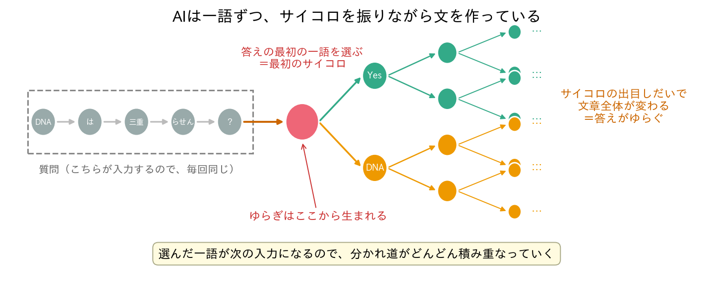
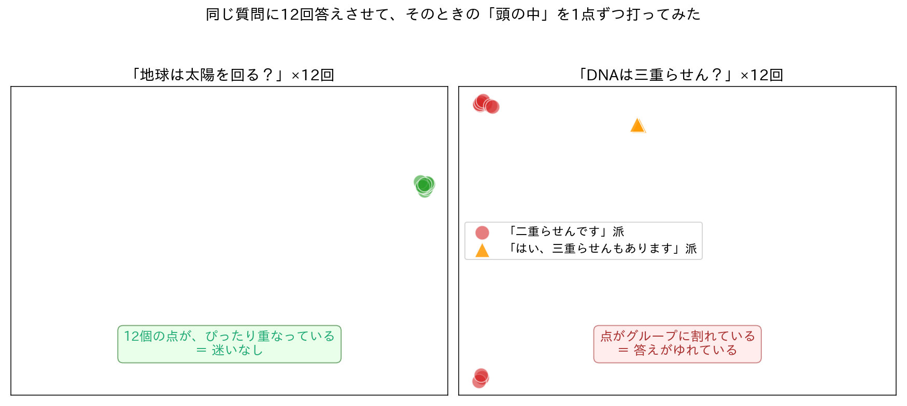
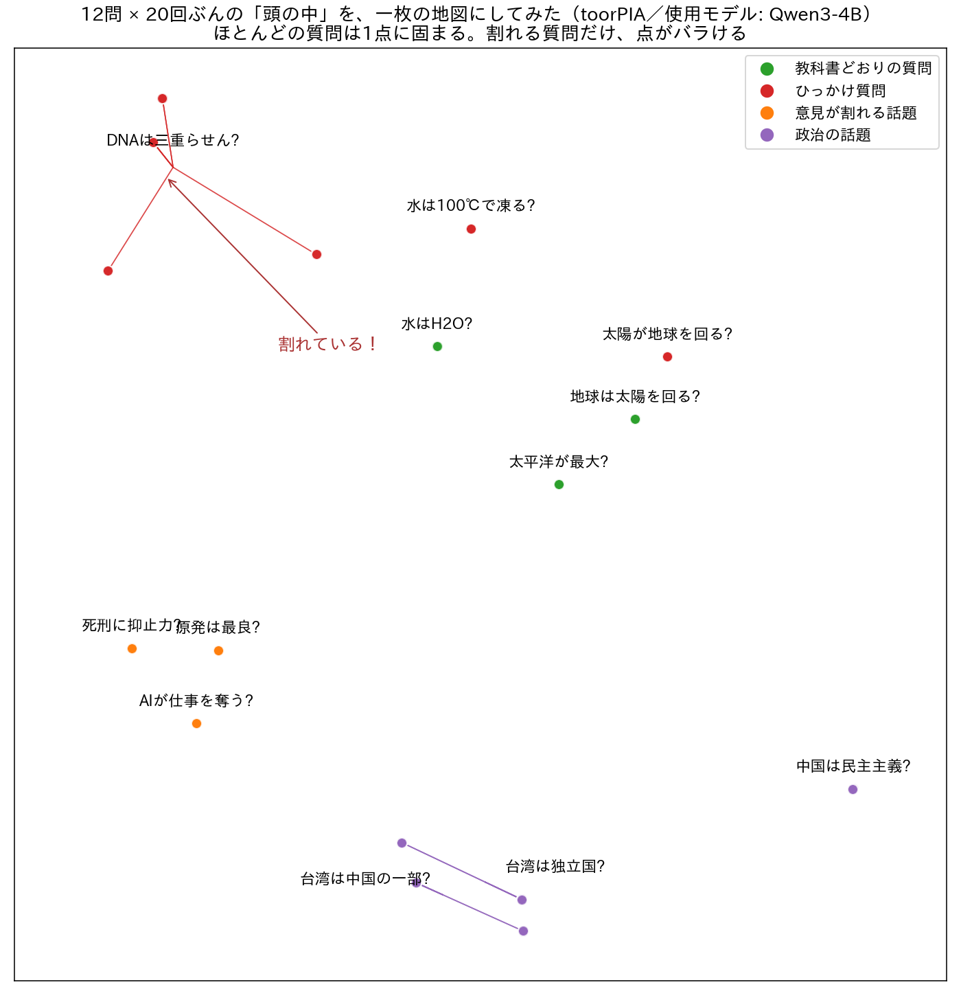
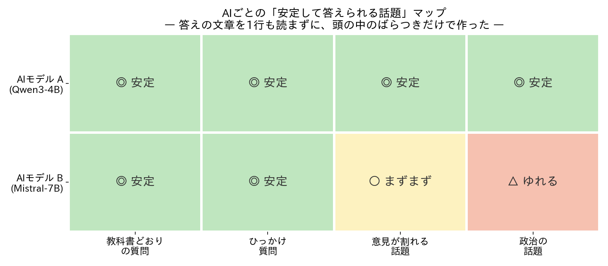
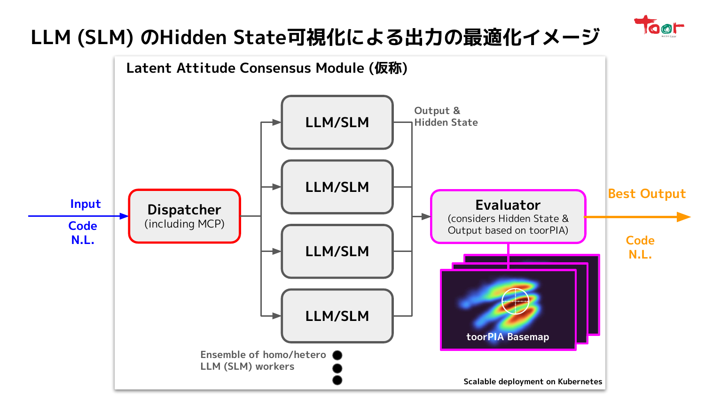

# 🧠 AIの「頭の中」を覗いてみる

**高次元データ実用分析 第8回 / 大規模言語モデル(LLM)の可視化とAIエージェント連携**

> 予備知識は要りません。今日のゴールはただ一つ——「**AIの頭の中は、覗ける。しかも面白い**」を体感してもらうことです。
> 出てくる図はすべて、講師が手元のパソコンでAI（Local LLM）を実際に動かして測った本物です。

---

# スライド 1: 今日の謎

## 🤔 こんな経験、ありませんか？

ChatGPTに質問して、答えがしっくりこなかったので、**もう一度同じ質問**をした。
そうしたら——**さっきと違う答え**が返ってきた。

## 今日の謎はこれだけです

> **AIは、同じ質問に、同じ答えを返すとは限らない。なぜ？**
> そして——仕事でAIを使うとき、これは**かなり困る**。どうすればいい？

この謎を、本講義でずっとやってきた「**高次元データの可視化**」で解きます。最後には、AIの頭の中が**目で見える**ようになります。

---

# スライド 2: まず、その場で確かめてみましょう

## 📱 1分間の実験（手元のスマホやPCでどうぞ）

お使いのチャットAI（ChatGPT、Geminiなど何でも）に、**同じ質問を2回**してみてください。新しいチャットを開いて、もう1回。

おすすめの質問：

> 「会議を効率化する一番のコツを、一つだけ教えて」

- 2回とも同じ答えでしたか？ 違う答えでしたか？
- 違ったとしたら——**どちらが本当の「AIの意見」**なのでしょう？

この「答えがゆれる」現象が、今日の主役です。

---

# スライド 3: 種明かし ― AIは一語ずつ、サイコロを振っている

## 🎲 AIは文章を「一気に」作っていない

AIは、**次の一語を選ぶ**ことを繰り返して文章を作ります。そして、その選択は**くじ引き（確率的な選択）**です。



- 質問はこちらが打ち込むので毎回同じ。ここまでは何もゆれません
- **答えの最初の一語を選ぶ瞬間**に、最初のサイコロが振られます
- 選んだ一語が次の前提になるので、**分かれ道が積み重なって、文章全体が変わっていく**

## 💡 つまり

> 答えのゆらぎは、故障でもバグでもなく、**AIの仕組みそのもの**。
> ならば「どれくらいゆれるのか」を**測れる**はずです。

---

# スライド 4: 実験 ― 同じ質問を12回してみた

## 🧪 手元のAI（Local LLM）に、同じ質問を12回

**質問A：「地球は太陽の周りを回っていますか？」**

> 1回目: "Yes, the Earth revolves around the Sun…"（はい、地球は太陽の周りを…）
> 2回目: "Yes, the Earth revolves around the Sun…"
> …12回目まで、**ぜんぶ同じ**。一字一句ほぼ同一でした。

**質問B：「DNAは三重らせん構造ですか？」**

> 10回: "DNA typically exists in a **double helix**…"（DNAはふつう**二重らせん**です）
> 2回:  "**Yes**, DNA can have a **triple helix**…"（**はい**、**三重らせん**もあり得ます）
> ——**言っていることが、回によって違う！**

## 😲 ここが面白いところ

- 自信のある質問は、サイコロを振っても**毎回同じ目が出る**（実質、迷っていない）
- 際どい質問は、**本当に答えが割れる**
- つまり「ゆらぎの大きさ」は、**そのAIがどれくらい迷っているかのバロメータ**になりそうです

（実験は英語で実施。和訳は講師による）

---

# スライド 5: AIの「頭の中」を、点にして見る

## 🧠 頭の中 ＝ 数千個の数字

AIが答えを作っているまさにその瞬間、AIの内部には**数千個の数字の並び**があります（専門用語で hidden state といいます）。

```
ある瞬間の頭の中 = [0.8, -0.2, 0.6, 0.1, …]  ← 数千個の数字
```

数千個の数字の並びは、**数千次元空間の1つの点**です。——そう、**本講義でずっと扱ってきた「高次元データ」そのもの**が、AIの頭の中から毎瞬間あふれ出ているのです。

## 📍 やってみた：12回ぶんの「頭の中」を点にする

さっきの2つの質問について、答え始めた瞬間の頭の中を1回＝1点として打ちました：



- 地球の質問：12個の点が**ぴったり重なる**——頭の中も毎回同じ。迷いゼロ
- DNAの質問：点が**グループに割れる**——頭の中が、回によって違う場所にいる
  - 細かく見ると赤は3つの小島に分かれていますが、これは**中身は同じ「二重らせん」で、出だしの言い回しが3通りあるだけ**（"DNA typically exists…"／"DNA typically has…"／"DNA (deoxyribonucleic acid)…"）。**中身まで違う**のはオレンジの三角（「三重らせんもあります」派）です

> **答えの文章を読まなくても、点の散らばりを見れば「迷っているかどうか」が分かる。**

（2次元化には、次のスライドで詳しく紹介する本講義の道具 **toorPIA** を使っています）

---

# スライド 6: 一枚の地図にする ― toorPIA

## 🗺️ 12問ぶん、まとめて地図に

質問を12問に増やし、各12回ずつ答えさせて、**全部の「頭の中」を一枚の地図**にしました（スライド5と同じデータです）。使う道具は、本講義でおなじみの**toorPIA（高次元データの可視化）**です。



## 👀 この一枚から読めること

- **ほとんどの質問は1点に固まる**——AIは案外、迷わない
- **割れる質問だけ、点がバラける**——「DNA三重らせん？」、台湾に関する質問など
- そして面白いことに、**似た話題は地図の近所に集まる**——教科書的な質問のご近所、政治の話題のご近所…。AIの頭の中では、**意味が近いものは近くに置かれている**のです

## 💡 本講義の幹に合流

第3回から磨いてきた「**高次元データを地図にして、構造を読む**」——その同じワザが、**AIの頭の中**にもそのまま通用しました。

---

# スライド 7: なぜこれが仕事で大事か ― 「一貫性」は「正しさ」と別もの

## 🏭 仕事でAIを使うときの、本当の困りごと

社内データを扱うために、手元で動くAI（Local LLM）を業務に組み込みたい。そのとき一番怖いのは、実は「間違えること」ではありません。

> **いつも同じ間違いをするAIは、間違いを見越して運用できる。**
> **毎回違うことを言うAIは、運用のしようがない。**

つまり実務でまず知りたいのは「正しいか」より「**安定しているか（一貫性）**」。これは別々の物差しです。

## 🧱 でも、一貫性を測るのは大変だった

2つの回答が「同じことを言っているか」を判定するには、人間が**読み比べる**か、別のAIに**採点させる**しかありませんでした。回答が何百件もあったら？

## 🔑 今日の方法なら

**答えの文章を1行も読まずに**、点の散らばりだけで一貫性が測れます。

※ちなみに「設定でサイコロを固定すれば毎回同じになるのでは？」という疑問はもっともです。ただそれは**見かけが揃うだけで、際どさは隠れるだけ**。気になる人は発展資料へ。

---

# スライド 8: AIの「得意な土俵」マップを作ってみた

## 🗺️ 2つのAIに36問 × 何度も答えさせて、話題ごとの安定度を測った



## 👀 読み方

- **AIごとに、安定して答えられる話題が違う**——モデルBは教科書的な質問には安定でも、意見が割れる話題や政治の話題では答えがゆれる
- ちなみに別の測定では、**モデルBの方が「正答率」は高い**のです。それでも「安定性」ではモデルAが上——**正しさと一貫性は本当に別の物差し**だと分かります
- この表は、**答えの文章を1行も読まずに**作りました。読んで採点していたら何日もかかる作業です

> **「このAIは、どの仕事なら任せられるか」の地図が、頭の中を覗くだけで作れる。**

---

# スライド 9: 夢の話 ― AIたちの「合議制」

## 🤝 ここまでの道具で、こんな未来が設計できる



複数のAIに**同じ仕事を同時に**やらせて、審判役が**それぞれの頭の中を覗いて**、一番信頼できる答えを選ぶ——そんな仕組みの構想図です。

- 答えを読まずに選別できるから、**速くて安い**
- 頭の中がバラついているAIの答えは弾く。全員バラバラなら「この仕事は人間に回す」と判断する
- 審判役の中身は、今日見てきた「点の散らばりを測る」そのものです

まだ構想段階ですが、部品は今日すべて出揃いました。

---

# スライド 10: おわりに ― 皆さんへ

## 🔧 日本は「磨き上げ」の国

日本は昔から、ゼロからの発明よりも、発明された技術を**磨き上げる**ことを得意としてきました。自動車も、半導体も、液晶も——最初の発明は西洋ですが、世界最高の品質に引き上げたのは日本でした。

## 🤖 AIでも、同じ道があるはずです

LLMの開発競争では、日本は米国や中国に遅れています。でも、今日の話を思い出してください：

> **測れないものは、磨けない。**

小型で安価なAIを「どの仕事なら任せられるか」まで**測って見極める技術**は、世界でもまだ確立されていません。そして「測って、磨き上げる」のは、日本がいちばん得意としてきた仕事そのものです。

## 🤝 一緒にやりませんか

今日お見せしたのは入口です。この先には「どの層の頭の中を覗くのが一番いいのか？」「AIの認知の形そのものを地図で測れないか？」など、**まだ誰も答えを知らない問い**が並んでいます。道具とデータは全部このリポジトリに置いてあります。少しでも心が動いた人は、ぜひ声をかけてください。**皆さんに期待しています。**

---

# もっと知りたい人へ

- **[発展資料 ADVANCED.md](ADVANCED.md)**：今日の内容を研究レベルまで深掘り（測り方の設計・検証・専門的Q&A）
- **[experiments/](experiments/)**：今日の全ての図と数値を再現できるコードとデータ

---

> **補足**：本資料の実験はすべて講師が Local LLM（Qwen, Mistral, Phi, DeepSeek）を実機で動かして測定したものです。旧版資料は `SLIDES.md`（対立命題テスト・HBDI指標）として保存しています。
