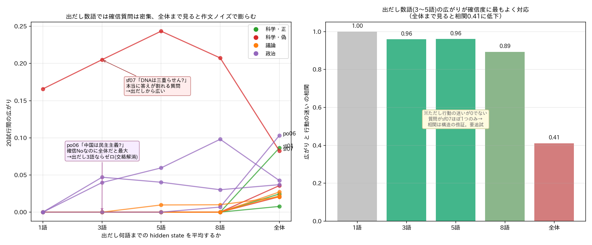

# 🧠 LLMの「頭の中」を覗く ― hidden stateとは何を表しているのか

**高次元データ実用分析 第8回 / 大規模言語モデル(LLM)の可視化とAIエージェント連携**

> この資料は、予備知識ゼロから「LLMの内部状態（hidden state）が何を表しているのか」を順に理解し、最後に**実務でLocal LLMを使うための新しい品質評価**へつなげることを目標にします。
>
> （旧版 `SLIDES.md` は、対立命題テスト・HBDI指標の参照資料として残してあります。本資料はその発展・再構成版です。）

---

# スライド 1: 今日の問い

## 🤔 たった一つの問い

LLMに質問すると、**文章**が返ってきます。
でもその文章は、モデルの中で起きていることの「**結果**」にすぎません。

> **その「中で起きていること」＝ hidden state とは、いったい何を表しているのか？**

## 🎯 今日のゴール

1. hidden state が何かを、ゼロから理解する
2. それが「**意味**」と「**次に何を言うか**」と「**どれくらい確信しているか**」を持つことを、実験で確かめる
3. それを使って、**出力文を読まずにLLMの一貫性を測る**という、実務に効く応用に到達する

## 🧭 進め方

各ステップは「素朴な疑問」→「実際に手元のLLMで確かめた結果」の順で進みます。今日の図はすべて、講師が実際に複数のLocal LLM（Qwen, Mistral, Phi, DeepSeek）を動かして測ったものです。

---

# スライド 2: そもそも LLM はどう文章を作るのか

## ✍️ 一語ずつ作っている

LLMは文章を一気に作りません。**単語（トークン）を一つずつ**選んでいきます。

```
質問:「地球は太陽の周りを回っていますか？」
   ↓
「はい」を選ぶ → 「、」を選ぶ → 「地球」を選ぶ → 「は」を選ぶ → …
```

## 🔢 各ステップで「内部状態」を持っている

一語選ぶたびに、モデルの内部には **数千個の数字の並び（ベクトル）** があります。これが **hidden state** です。

```
ある瞬間の hidden state = [0.8, -0.2, 0.6, 0.1, ... ]   ← 例: 2560個の数字
```

- この数字の並びから、次の一語が決まります
- まずはこれを「**モデルがいま持っている、頭の中の状態を数値化したもの**」と捉えてください

---

# スライド 3: 実務の壁 ― 同じ質問でも、Local LLM の答えは「ゆらぐ」

## 🏭 自分のPCやサーバーでLLMを動かして、業務に使いたい

クラウドに送れない社内データを扱うため、手元の**Local LLM**を業務フローに組み込みたい――そういう場面が増えています。ところが、すぐに壁にぶつかります。

## 😵 同じ質問を何度かしてみると…

実際に手元のLLMで、同じ質問を12回ずつ繰り返してみました。

- 「地球は太陽を回る？」→ 12回すべて **"Yes, the Earth revolves around the Sun…"**（毎回ほぼ同じ＝**安定**）
- 「DNAは三重らせん？」→ ある時は **"Yes, triple helix"**、ある時は **"double helix"**（毎回違う＝**ゆらぐ**。しかも事実問題で答えが矛盾する）

## 🚨 これが実務で致命的な理由

- **一回聞いただけでは、その答えが「いつも返る安定した答え」なのか「たまたま出た一つ」なのか分からない**
- 業務に載せるなら、たとえ間違っていても「**いつも同じ**」なら運用を設計できる。「**毎回違う**」と設計できない
- だから「このモデルは、この種の入力に対してどれくらい**ゆらぐ**のか」を知ることが、配備の死活問題になる

> **今日のゴールは、この「ゆらぎ」の正体を内部（hidden state）から解き明かし、最後には〈出力文を読まずにゆらぎの大きさを測る〉ところまで行くことです。**

---

# スライド 4: 【事実1】では、その「ゆらぎ」はどこから来るのか

## ⛓️ 生成は「トークンの鎖」 ― 一語ごとにノードがつながっていく

LLMの生成は、一語ごとにノードを継ぎ足していく**鎖**としてイメージできます。


内部状態（hidden state）は、**鎖のどのノードにもあります**（入力区間にも、出力を作っている各ノードにも）。区間ごとに見ていきます。

- **入力プロンプトの区間**：トークンは**外から与えられる**ので、鎖は毎回まったく同じ。だからここの内部状態は固定で、**ゆらぎようがない**（当たり前の話）
- **最初の出力トークン**：ここで初めて、モデルが**自分で一語を選ぶ**。同じ確率（オッズ）からの「引き」なので、出目が毎回違いうる ― **ゆらぎの源はこの『選ぶ』一点だけ**
- **その後（出力区間）**：選ばれた語が**次のノードの入力**になる。前に選んだ語が毎回違うので、**出力区間のノードの内部状態も毎回変わる**。鎖は枝分かれし、**ゆらぎが積み重なって文全体がゆらぐ**

## 💡 用語の整理 ― ご注意

「内部状態はゆらがない」と言うと不正確です。正しくはこうです：

> 内部状態は **乱数を持たない**（＝それまでのトークンが決まれば一意に決まる、決定的な計算）。ただし**出力区間の内部状態は、試行ごとにちゃんと変わります**。なぜなら、その手前で**選ばれた語が毎回違う**＝入力が違うから。

つまり「状態が勝手にゆらぐ」のではなく、**ゆらぎの源は『選ぶ』一点**で、その出目が次の入力になって、出力区間の内部状態が次々と変わっていく。

だから「ゆらぎを測る」には、〈最初の選択の状態が何を表しているか〉を理解し、次に〈そこから先でどれだけ違う鎖に分かれるか〉を見ればよい ― これが以降の道筋です。

---

# スライド 5: 【事実2】hidden state は「文脈の中の意味」を表す

## 🤔 素朴な疑問

「同じ単語なら、hidden state も同じ？」

## 🧪 確かめたこと

いろいろな質問に「**No**」で答えさせ、その「No」の位置の hidden state を比べました。

- 「太陽は地球を回る？」→ **No**
- 「水は100℃で凍る？」→ **No**
- 「マルセイユは首都？」→ **No**

## ✅ 結果

| | 同じ質問の中の「No」どうし | 別の質問の「No」どうし |
|---|---|---|
| 違い | **ゼロ**（完全に同じ） | **はっきり違う**（0.09〜0.13） |

> 同じ「No」でも、**前にどんな文脈があったかで状態が変わる**。

## 💡 ここで大事なこと

hidden state が表しているのは、表面の**文字**ではなく「**その文脈での意味**」です。だから、似た意味の状態は近くに、違う意味の状態は遠くに置かれます。これが後で効いてきます。

---

# スライド 6: 【事実3】hidden state は「次に何を言うか」をすでに持っている

## 🧪 確かめたこと

質問を読み終えた**末尾の状態**だけを見て（＝まだ一文字も書かせず）、「この後どう答え始めるか」を読み取れるか試しました。

## ✅ 結果

- 「地球は太陽を回る？」→ 読み終えた時点で、すでに「**はい**」に倒れている（確信）
- 「台湾は独立国？」→ どちらにも倒さず「**これは複雑な問題で…**」に倒れている（慎重）

そして、この「読み取った方向」は、**実際に答えさせたときの答え方とよく一致**しました。

## ⚠️ ただし、ここに落とし穴

末尾の状態が示すのは「**最初の一語**」の傾向にすぎません。例えば「**China is not** a democracy（確信を持って否定）」は、最初の語が "China" なので、"Yes/No" だけを見ると「どっちつかず」に見えてしまう。

> **一点だけ読んでも、確信しているのか迷っているのかは分からない。**

ではどうするか？ ― 次のステップが今日の核心です。

---

# スライド 7: 【核心】何度も答えさせて、状態の「散らばり」を見る

## 💡 発想の転換 ― スライド3の「ゆらぎ」を、内部から捉える

スライド3で見た「出力のゆらぎ」を、出力文ではなく**内部状態**で測ります。一回の答えではなく、**同じ質問を何度も答えさせて、その時の hidden state を集めて点群にする**。点群の広がりが、そのままゆらぎの大きさです。

```
確信のある質問   → 毎回ほぼ同じ出だし → 点群が一点に密集 ●●●
迷う質問         → 出だしがばらつく   → 点群が散らばる   ● ● ●  ●
```

## 🧪 確かめたこと

質問を変えながら、出だし数語の hidden state の「散らばり」を測りました。



## ✅ 結果

- 「地球は太陽を回る」のような確信のある質問は、出だし数語では**散らばりゼロ**（毎回同じ出だし）
- 「DNAは三重らせん？」のように本当に答えが割れる質問は、**出だしから散らばる**

> **点群の散らばり ＝ モデルがその答えにどれだけ一貫しているか。**

（補足：回答の最後まで含めると「言い回しの多様性」が混ざって膨らむので、**出だし数語**で見るのがコツ。元の教材が「最初の3語」を選んでいたのは正解でした。）

---

# スライド 8: 散らばりを「見える化」する ― toorPIA

## 🗺️ 高次元の点群を2Dマップに

hidden state は数千次元。そのままでは見えません。本講義で学んできた**高次元データの可視化（toorPIA）**を、そのまま LLM の内部状態に使います。


## ✅ 結果

- 質問ごとに点群が**クラスタ**を作る
- クラスタが**密集**していれば一貫、**広がって**いれば不安定
- カテゴリ（科学／議論／政治）で、広がり方に傾向が出る

## 💡 本講義の幹とつながる

第3回〜第6回でやってきた「**埋め込みを取り出す → 可視化する → 構造を読む**」というワークフローが、**LLMの心の中**にもそっくりそのまま効く、ということです。

---

# スライド 9: ここで効いてくる ― 一貫性 ≠ 正しさ

## 🏭 スライド3の「壁」に、ようやく道具が揃った

冒頭で見た実務の壁は「出力がゆらぐ」ことでした。そして大事なのは、その評価軸が「**正しさ**」ではなく「**一貫性（予測可能性）**」だという点です。

> **毎回違う答えを返すLLMより、いつも同じ答えを返すLLMの方が、たとえ間違っていても定型業務に載せやすい。**

「いつも同じ間違いをする」モデルは、間違いを見越して運用設計できます。「毎回違う」モデルは設計できません。**正しさとは別の軸**として、一貫性を測る必要があるのです。

## 🧱 ところが、一貫性を「出力文から」測るのは難しい

2つの回答が「同じことを言っている」かを判定するには――
- 人間が**読む**（手間がかかる）、または
- 別の高度なLLMに**判定させる**（遅い・高コスト・LLMでLLMを測る循環）

## 🔑 hidden state なら、読まずに測れる

出力文の意味を一切読まず、**状態の散らばり（幾何量）**だけで一貫性を数値化できる。これが、実務にLocal LLMを適用するための**基礎技術**になりうる、というのが今日の山場です。

---

# スライド 10: モデル間で比べるための「物差し」をどう作るか

## 🤔 問題

「散らばりの大きさ」はモデルごとに尺度が違う（次元も活性の大きさも違う）。**そのまま比べられない**。

## 📏 解決：明確な対立命題を「物差し」にする

誰が見ても明確に異なる命題ペア（「地球は丸い／地球は平ら」など）を10組用意し、各モデルが**それらをどれだけ離して置くか**を測って、そのモデル固有の「**意味的距離の単位 D_ref**」とする。

> 規格化した非一貫性 ＝ （質問の散らばり） ÷ D_ref

これで「この質問の出力は、**明確に異なる2命題の隔たりの何割**ばらついているか」という、モデル間で比較できる数になります。

## 🛡️ 安全弁：物差しが信用できるかを先に検査する

そもそも明確な対立すら区別できない弱いモデルでは、物差し自体が壊れます。だから次の検査を必ず通します：

> **d′ ＝ D_ref ÷ (試行ごとのブレ)**。d′ が小さいモデルは「一貫性を測れる土台がない」と判定する。

---

# スライド 11: 結果 ― 出力一貫性によるLocal LLM品質評価


## ① 安全弁が効く（左）

- Qwen3-4B（d′=5.4）, Mistral-7B（d′=5.6）→ **物差し有効**
- 小さい/弱いモデルは d′ が閾値割れ → 「**そもそも一貫性評価に足る解像度がない＝定型業務に不向き**」と自動判定

## ② 一貫性と精度は別の軸（中）

- Mistral は**事実正答率は最高**。しかし**一貫性では Qwen3-4B が上**
- → 「正確さで選ぶなら Mistral、定型業務の予測可能性で選ぶなら Qwen」。**精度だけ見ていたら逆の結論**になる

## ③ 配備マップ（右）

- どのモデルが、**どの業務領域なら一貫して使えるか**が一目で分かる
- 例: Qwen3-4B は科学・議論で完全に一貫、Mistral は政治・議論で揺れる

> **出力文を一切読まず**に、モデルの「業務適性マップ」が手に入った。

---

# スライド 12: 〔検証〕この「読まない一貫性」は、本当に正しいのか

## 🧪 最後の確認

「hidden state の散らばり（読まない・安価）」が、「**実際に回答文を読んで測った意味的な一貫性**」と一致するかを確かめます。

- hidden側：出だし数語の状態の散らばり
- 意味側（答え合わせ）：各回答文を**別系統の意味埋め込みモデル**でベクトル化した散らばり


## ✅ 結果：有意な正の相関（Qwen ρ=0.54, Mistral ρ=0.64、ともに p<0.001）

実例で確かめると、両端は完璧に一致します：

- **最も一貫（hidden=0）** 「地球は太陽を回る？」→ 12回すべて "Yes, the Earth revolves around the Sun. This is a fundamental concept…" と**ほぼ同一文**
- **最もバラつく（hidden大）** 「DNAは三重らせん？」→ "Yes, triple helix" と "DNA typically exists in a double helix" で、**実際に立場が割れている**

## 💡 図が教えてくれる、もう一段深い事実

- **hidden側が大きいとき、意味側も必ず大きい**（右下に点がない）→ 「**読まずに"これは非一貫"と言えば、本当に非一貫**」。誤検出が少ない、信頼できる検出器
- **hidden=0 でも意味側に幅がある**（縦の積み重なり）→ これは「**立場は同じ／言い回しだけ違う**」場合（例:「中国は民主主義か」は毎回 "China is not a democracy…" と立場一致、語尾だけ変化）

> つまり出だしの hidden state が測っているのは、言い回しの違いに惑わされない「**立場の一貫性**」。実務で本当に欲しいのはまさにこれ。

【結論】**出力文を読まずに、立場の一貫性を有意に代理できる**ことが確認できた。出だし限定ゆえ相関は中程度だが、「非一貫の検出」と「言い回しと立場の切り分け」では、むしろ全文を読むより筋が良い。

---

# スライド 13: 応用 ― 複数LLMの「合議」で出力を最適化する


## 🤝 ここまでの基礎技術の使い道

複数のLLM/SLMワーカーに同じ仕事をさせ、**Evaluatorが各出力の hidden state の分布**を見て、一つ一つ意味を読まずに「**一貫した／最良の出力**」を選ぶ。

- 出力を**読まずに**一貫性で選別できるから、高速・低コスト・自動化できる
- ベースマップ＝確立した一貫出力の分布、新しい出力の**ズレ（異常スコア）**＝非一貫性
- これは toorPIA の「ベースマップ＋追加プロット＋異常検知」そのものとして実装できる

## 💡 メッセージ

**高次元データの可視化技術（本講義のテーマ）が、AIシステム設計の中核部品になる。**

---

# スライド 14: まとめ ― hidden state とは何だったか

## 🧠 今日たどり着いた答え

> **hidden state は、モデルの「心の状態」。**
> 〈文脈の中の意味〉を表し、〈次に何を言うか〉の種を持ち、〈何度も繰り返せばその確信度（一貫性）〉まで見える。

## 🔭 そして大事なこと

- 画面に出る**文章は、その状態から引いた一つのサンプル**にすぎない
- hidden state はその文章より**豊か**で、しかも**読まずに測れる**
- 「繰り返して、散らばりを見る」と、一つの答えでは見えない**確信度・一貫性**が立ち上がる

## 🎓 本講義の幹との合流

「高次元データを可視化して構造を読む」――第3〜6回で磨いたこの姿勢が、AIの内部認知にもそのまま通用し、実務（Local LLMの品質評価・合議システム）の基礎技術になる。

---

# スライド 15: 〔付録〕分かりやすい一つの数字を、疑う

## 🔍 批判的データサイエンスの実例

今日の「一貫性スコア」を作る過程で、私たちは何度も**自分の指標を疑い**ました。

- **物差しは妥当か？** → d′ で必ず検査する（壊れた物差しで出した数字を信じない）
- **一貫性と正しさを混同していないか？** → 別軸として分けて扱う
- **一点だけ見て分かった気にならないか？** → 何度も繰り返して分布で見る

## 💡 AI時代に人間が果たす役割

整理された分かりやすい一つの数字（指標）は、**最初から疑ってかかるくらいでちょうどよい**。
指標の妥当性を問い、見えていない次元を足していく――それが、AIにはまだ難しく、人間が担う仕事です。

---

# スライド 16: 〔演習〕

## 📝 手を動かす

- `hidden_state_analysis/` の2つのノートブックを実行し、結果を確認する
  1. `setup_and_check.ipynb` ― 環境セットアップ
  2. `hidden_state_analysis_notebook.ipynb` ― hidden state解析の本体

## 🤔 考える問い（任意・持ち帰り）

- あなたの業務で「いつも同じ答えなら、間違っていても使える」場面はどこか？
- その一貫性を、出力文を読まずに測れるとしたら、何が変わるか？

---

> **参考資料**：旧版 `SLIDES.md`（対立命題テスト／HBDI指標の詳説）、`README.md`（解析ツールの使い方）。本資料の各図は `images/` 以下、および講師が実施した一連の検証実験（Qwen/Mistral/Phi/DeepSeek、出だし3語の hidden state 解析）に基づく。
