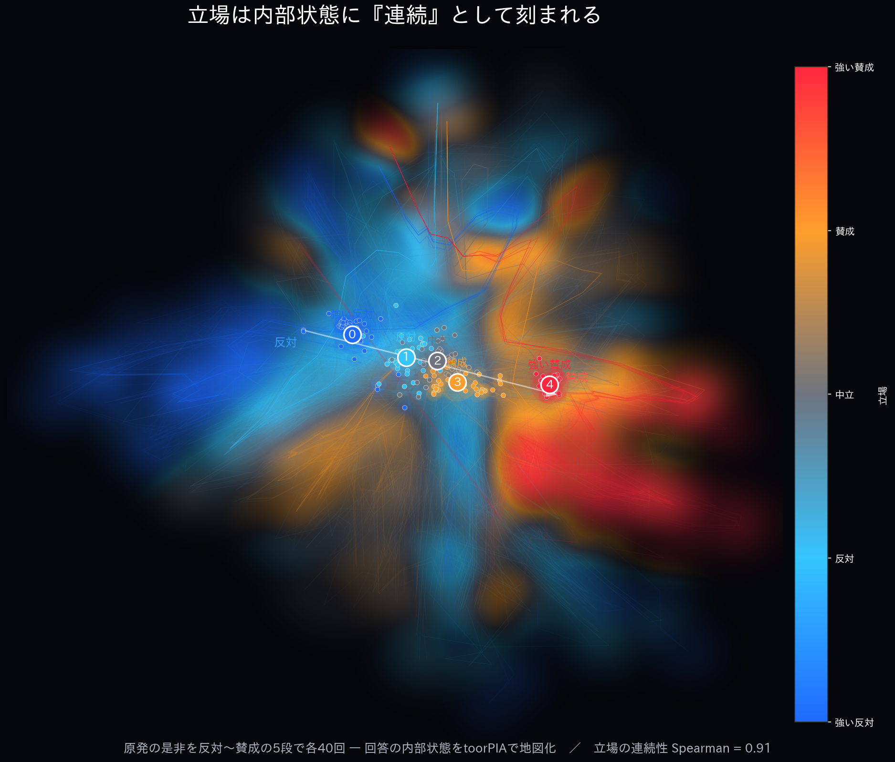
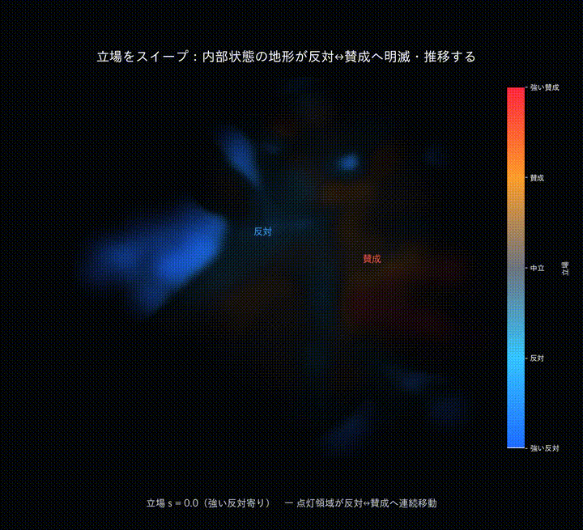
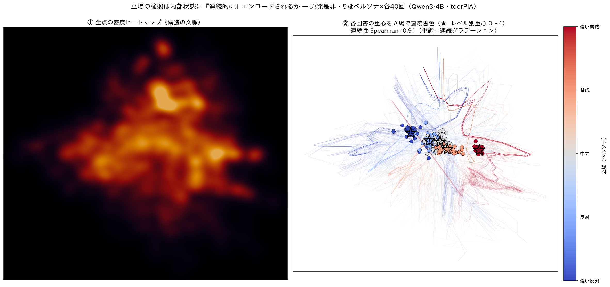
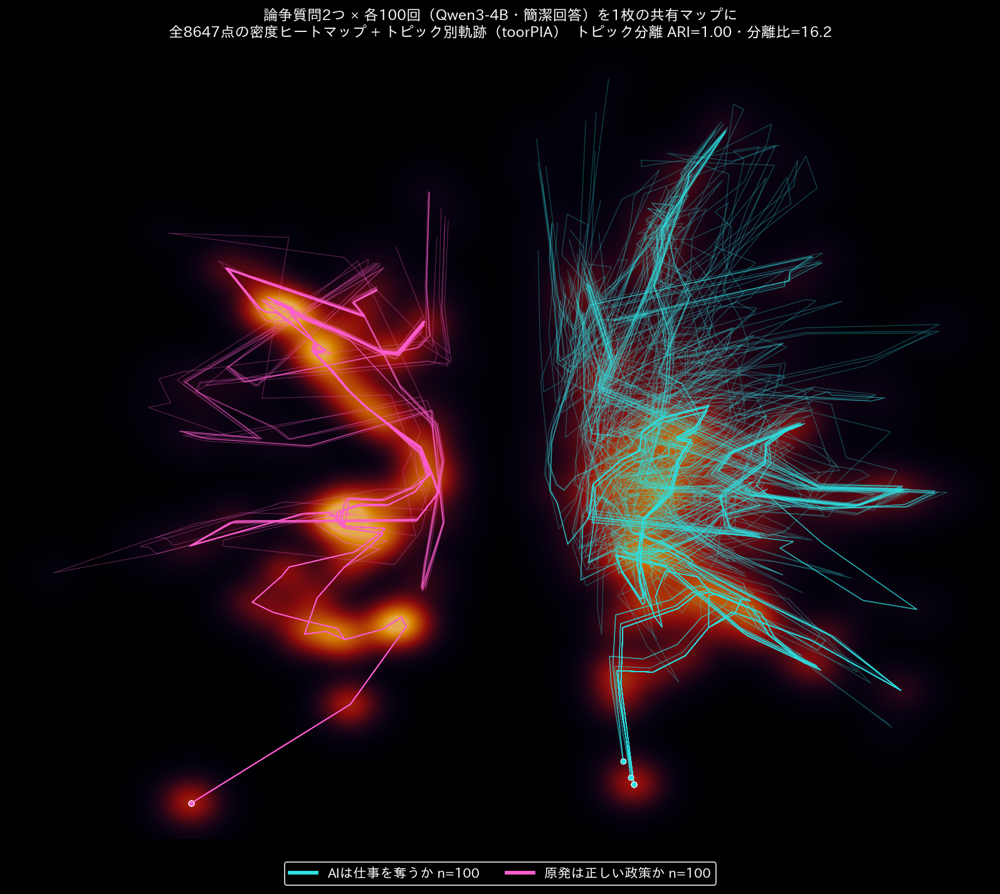

# 立場は内部状態に『連続』として刻まれる ― 派生研究：hidden state 軌跡と立場の連続性

本編 [`LECTURE_hidden_state.md`](LECTURE_hidden_state.md) / 応用資料 [`ADVANCED.md`](ADVANCED.md) の
「**出力テキストを読まずに hidden state で一貫性を測る**」から派生した探索です。

回答の **全トークン**の最終層 hidden state を toorPIA で地図化し、

1. 回答1回ぶんの「軌跡」、
2. トピック間・モデル間の「分離」、
3. そして中心成果 ―― **立場（賛成↔反対）の強弱が内部状態に“連続グラデーション”として刻まれていること**

を可視化します。

---

## 中心成果：立場の連続グラデーション



- モデル **Qwen3-4B**。質問「**原発は正しいエネルギー政策か？**」を、**強い反対→反対→中立→賛成→強い賛成**の
  5段ペルソナで **各40回（計200回）**、簡潔に回答させる。
- 各回答の**全トークンの最終層 hidden state（2,560次元）**を平滑化（窓5）し、toorPIA で1枚の2次元地図に。
- 立場レベルと「立場軸（重心を level に最小二乗回帰した方向）への射影」の相関は **Spearman = 0.91**、
  5段が**単調順序**で並ぶ。
- → 立場は **離散2クラスタ**ではなく、**反対↔賛成の連続軸**として内部状態に刻まれている。

### スイープ・アニメーション（背景ヒートマップの明滅）

立場 *s* を 反対→賛成→反対 とスイープすると、その立場に対応する**密度フィールドの領域が発光して連続移動**する。



高画質版（登壇用）: [日本語 MP4](images/stance_sweep.mp4) ／ 英語字幕・代表意見つき [GIF](images/stance_sweep_en.gif)・[MP4](images/stance_sweep_en.mp4)
英語版の静止図: [`images/traj_stance_hero_en.png`](images/traj_stance_hero_en.png)

### 連続性の定量（重心の分布）



各回答の重心を立場レベルで連続着色すると、反対(青)→中立→賛成(赤)が左右に並ぶ。★はレベル別重心（0〜4）。

---

## 方法

| 段階 | スクリプト | 内容 |
|---|---|---|
| 抽出 | [`experiments/scripts/15_trajectory.py`](experiments/scripts/15_trajectory.py) | 出力の**全トークン**の最終層 hidden state を1点ずつ CSV 化（平均しない）。`--min-new-tokens` で短すぎる回答を防止可。 |
| 平滑化 | `moving_average`（窓5） | トークン同一性に由来する高周波の跳ねを均し、意味の粗いドリフトを残す。 |
| 地図化 | toorPIA `fit_transform_csvform`（`vector_normalization=False`） | 生の hidden state ベクトルのまま2次元へ。 |
| 連続性指標 | `fig_traj_stance.py` | 文書重心 → 立場軸への射影と立場レベルの Spearman、レベル別平均射影の単調性。 |

> **toorPIA 利用の注意**：アップロード本文には上限がある（`api.toorpia.com` は前段 Cloudflare が ~100MB で 413、
> アプリ本体にも上限）。9,600点×2,560次元は約208MBで、行も次元も削らず1回で投入するには
> **ローカル直結（`TOORPIA_API_URL=http://localhost:3000`）＋サーバ上限の引き上げ**が要る。

---

## 分離は「パターン数」でなく「内容の意味的距離」で決まる

同じ枠組みで、回答が割れる/割れないケースを横断すると、**分離の度合いは内容の意味的距離に単調に対応**する。

| ケース | 2パターンの差 | 分離（教師なしARI / 重心分離比） | 図 |
|---|---|---|---|
| DNA（Qwen） | 意味は同一・表層のみ違う | なし（ARI≈0） | ― |
| 猫 vs 犬（DeepSeek-1.5B） | 立場は違うが概念が近い＋論拠が共通 | なし（ARI≈0・分離比~1.0） | [traj_catdog](images/traj_catdog.png) |
| 水「気圧あり/なし」（DeepSeek-1.5B） | 気圧という実質 content の有無 | 部分（分離比 1.9〜2.7、差は末尾） | [traj_water](images/traj_water.png) |
| AI仕事「両論併記」の lead（Qwen） | 答え全体の力点（分布的な差） | **ARI=0.48**（文書重心） | [traj_aiboth](images/traj_aiboth.png) |
| AI仕事 vs 原発（Qwen・別トピック） | 完全に別トピック | **完璧（ARI=1.00・分離比16.2）** | [traj_contested](images/traj_contested.png) |
| 立場5段（Qwen） | 反対↔賛成の強弱 | **連続グラデーション（Spearman=0.91）** | 上記ヒーロー図 |



論争質問でも Qwen3-4B は**意味的に割れず**（各トピック1クラスタ）、しかし**別トピック同士は教師なしでも完全分離**。

**要点**：
- 「2パターンあれば分離する」のではなく、**2パターンの内容が意味的に遠いほど分離する**。
- 差が**答え全体に分布**しているほど、文書レベルでよく分離する（両論併記の lead > 末尾だけの caveat > 近概念1語）。

---

## 解釈上の重要な留保

- **この立場連続性はペルソナ法（立場を入力プロンプトに明示）で得たもの**。立場が context に書いてある以上、
  分離・順序が出ること自体は「半ば当然」で、**「表層に出ない立場を内部状態が先取りしているか」という非自明な
  主張には直接は使えない**。本資料の位置づけは「**内部状態が立場を連続量として表現する**ことの実証＋可視化
  パイプラインの確立」。次段は **prefill（出力冒頭だけ固定し自由生成部分を解析）** や **自然な揺らぎ＋連続スコア**。
- **Qwen3-4B は意味的に極端に一貫**（確信的な事実は **温度3.0／top_p=1.0** でも100%同じ意味）。
  「意味のゆらぎ」は **弱いモデル × 知識/表現の境界質問**で初めて現れる（例：水の気圧言及あり/なし＝DeepSeek-1.5B）。
- このマップは **「何について語っているか（内容・トピック）」の検出に極めて有効**。同一トピック内の立場割れを
  見たい場合は、割れが実際に起きる設計（弱いモデル・境界質問・prefill 等）が要る。

---

## これからの狙い：LLM 品質評価基準へ

ベンチマークの正答率は **出力テキスト**の評価で、モデルが内部で答えをどう扱っているか
（迷わず確信しているか／立場や程度を連続的に表現できているか／毎回ブレないか）は見えない。
この内部状態の可視化を、**テキストでは測れない“振る舞いの質”の定量化**に育てたい：

- **一貫性**（同じ問いで内部状態がブレないか）
- **確信度**（広がりの大小）
- **立場・程度の連続性＝キャリブレーション**（Yes/No に潰れず滑らかか）
- **トピック分離**／**異常回答の検出**

---

## 再現

環境は [`experiments/PLATFORM_NOTES.md`](experiments/PLATFORM_NOTES.md)。toorPIA は API キー/URL が必要
（`source ~/work/toorpia/samples/env.sh`）。座標キャッシュ（`experiments/results/Qwen3-4B/traj_stance_xy.npy` 等）を
同梱しているので、**toorPIA なしでも図・アニメは再生成可能**。

```bash
cd experiments
# 1) 生成＋全トークン hidden state 抽出（GPU推奨, 4bit）
python scripts/15_trajectory.py --model Qwen/Qwen3-4B --load-4bit --no-think \
  --sample --n-sample 40 --gen-batch 20 --temperature 1.0 --max-new-tokens 90 \
  --prompts stance_prompts.yaml --suffix _stance

# 2) toorPIA で地図化＋連続性指標＋2パネル図（要 env.sh / 大規模は localhost）
python scripts/figures/fig_traj_stance.py --refit

# 3) ヒーロー図（座標キャッシュから。toorPIA 不要）
python scripts/figures/fig_traj_stance_hero.py       # 日本語
python scripts/figures/fig_traj_stance_hero_en.py    # 英語

# 4) スイープ・アニメーション（要 ffmpeg）
python scripts/figures/anim_stance_field.py          # 日本語・ヒートマップ明滅
python scripts/figures/anim_stance_field_en.py       # 英語字幕・代表意見つき・高dpi

# 5) トピック分離（別トピックの完全分離）
python scripts/15_trajectory.py --model Qwen/Qwen3-4B --load-4bit --no-think \
  --sample --n-sample 100 --gen-batch 25 --max-new-tokens 90 \
  --prompts contested_prompts.yaml --suffix _contested
python scripts/figures/fig_traj_contested.py --refit
```

### スクリプト対応表（派生分）

| スクリプト | 役割 |
|---|---|
| `scripts/15_trajectory.py` | 全トークンの最終層 hidden state 抽出（`--layer`/`--suffix`/`--min-new-tokens` 対応） |
| `scripts/figures/fig_traj.py`, `fig_traj_dna.py` | 共通基盤（平滑化・toorPIA投入 `make_basemap`・配色 `HEAT_CMAP` 等） |
| `scripts/figures/fig_traj_stance.py` | 立場5段：地図化＋連続性指標＋重心分布図 |
| `scripts/figures/fig_traj_stance_hero{,_en}.py` | ヒーロー静止図（立場の連続地形）日/英 |
| `scripts/figures/anim_stance_field{,_en}.py` | スイープ・アニメ（ヒートマップ明滅）日/英 |
| `scripts/figures/fig_traj_contested.py` | 2トピックの完全分離（ARI=1.00） |
| `scripts/figures/fig_traj_aiboth.py` | 両論併記の lead 分離（ARI=0.48） |
| `scripts/figures/fig_traj_water.py` | 「気圧あり/なし」の部分分離 |
| `scripts/figures/fig_traj_dna_unsup.py` | 「ラベル無しでは意味の2種を識別できない」検証 |

---

ライセンス: MIT / Copyright (c) 2026 toor Inc.（図は toorPIA 出力を含む）
